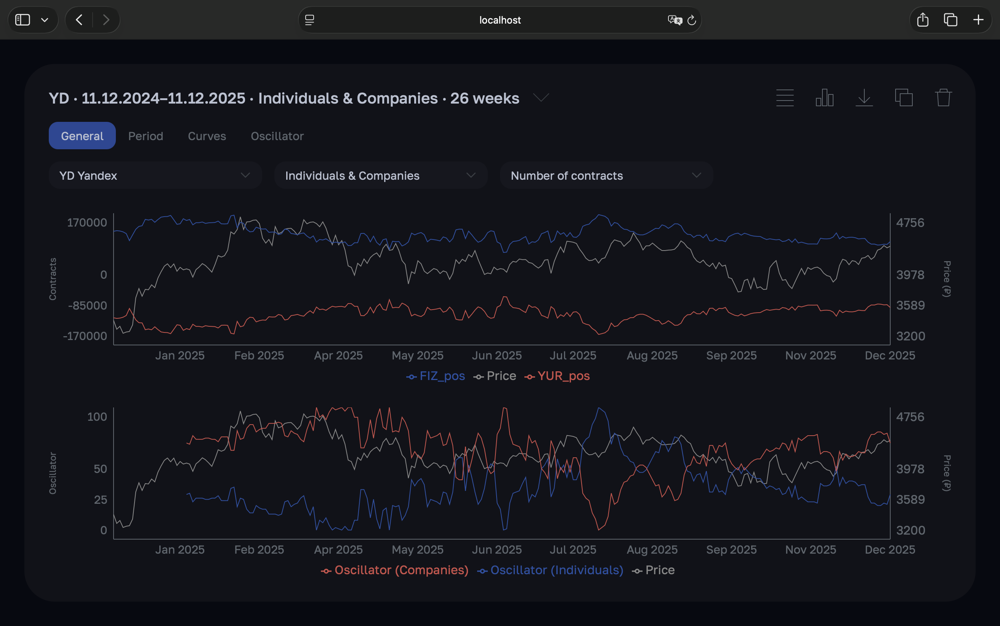

## Overview

MOEX analytics workspace: FastAPI backend fetches market data from the MOEX API, processes candles and futures open
interest, and builds synthetic instruments alongside live ones. It delivers clean, ready-to-plot datasets to a React
frontend that renders interactive charts for users.

## Screenshot

## Backend Setup

1. Open `env.example`, add your real API key, then save the file as `.env`.

2. Go to the `moex-analytics-main/server` folder: `cd moex-analytics-main/server`.

3. Create a Python virtual environment: `python3 -m venv venv`.

4. Activate the virtual environment: `source venv/bin/activate`.

5. Install Python dependencies: `pip install -r requirements.txt`.

6. Run the server: `python3 main.py`.

## Frontend Setup

1. Go to the `moex-analytics-main/frontend` folder: `cd moex-analytics-main/frontend`.

2. Install dependencies: `npm install`.

3. Start the dev server: `npm run dev`.

## How to Use

Just open the URL printed by `npm run dev`.
